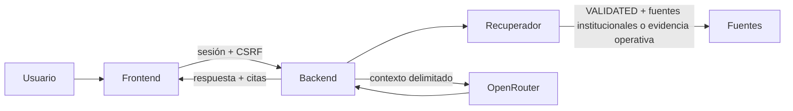

# Asistente Documental con OpenRouter

## Estado de entrega

El asistente académico está integrado entre el backend de Tramita y el frontend. El proveedor permanece deshabilitado por defecto hasta que la Coordinación aporte y valide fuentes institucionales.

La pantalla está en el frontend `tramita-frontend-main/app/assistant/page.tsx` y consume exclusivamente `POST /api/assistant`. La API key nunca se entrega al navegador ni se persiste en el repositorio.

## Flujo



1. El backend valida la pregunta, la sesión y el token CSRF.
2. La búsqueda consulta únicamente fragmentos con estado `VALIDATED`: fuentes `OFFICIAL_INSTITUTIONAL` y evidencia `INTERVIEW_EVIDENCE` contrastada con la transcripción original.
3. Sin evidencia, responde `grounded: false` y no llama al proveedor externo.
4. Con evidencia y la integración habilitada, OpenRouter recibe la pregunta y los fragmentos recuperados como contexto delimitado.
5. La respuesta muestra sus fuentes y el aviso de que la decisión corresponde a la institución.

El asistente no cambia solicitudes, no ejecuta transiciones y no puede acceder directamente a la base de datos ni al sistema de archivos.

## Configuración local

Las variables están documentadas en `.env.example`:

```text
APP_AI_ENABLED=false
OPENROUTER_API_KEY=
OPENROUTER_BASE_URL=https://openrouter.ai/api/v1
OPENROUTER_MODEL=
OPENROUTER_MAX_TOKENS=500
OPENROUTER_TIMEOUT_SECONDS=20
OPENROUTER_MAX_REQUESTS=10
OPENROUTER_WINDOW_SECONDS=60
```

Para habilitar el proveedor en un entorno local controlado, establecer `APP_AI_ENABLED=true`, una clave válida fuera del repositorio y un modelo explícito. La clave no se debe copiar a `.env.example`, fixtures, logs ni al frontend.

El backend limita por defecto a 10 consultas por minuto para cada usuario autenticado. Si se supera el límite, responde `429 application/problem+json` e incluye `Retry-After`; el frontend presenta el error del backend sin reintentar automáticamente.

## Activación responsable

Antes de habilitar respuestas normativas se requiere registrar fuentes institucionales con versión, emisor, hash y ubicación, y marcar la fuente como `VALIDATED`. Las entrevistas y los documentos de análisis del proyecto son evidencia de contexto, pero no sustituyen un reglamento ni un procedimiento institucional validado.

Hasta cumplir esa condición, el comportamiento esperado es una abstención segura:

```json
{
  "answer": "No encontré respaldo suficiente en las fuentes validadas disponibles.",
  "grounded": false,
  "sources": []
}
```

## Evidencia

- Contrato HTTP: `specs/002-workflow-engine/contracts/openapi.yaml`.
- Backend: `mvnw.cmd clean verify -Dit.test=RequestControllerIT -q` con Java 25: 22 pruebas de integración aprobadas.
- Frontend: `pnpm test lib/api.test.ts`: 27 pruebas aprobadas.

La evidencia operativa anonimizada de las entrevistas a la Coordinación se carga con la migración `V5.1.0` para la demostración. El asistente la presenta como orientación informativa, no como norma institucional. El siguiente paso para respuestas normativas sigue siendo obtener y validar el Reglamento Estudiantil y los procedimientos de adición de créditos y novedad de notas.
