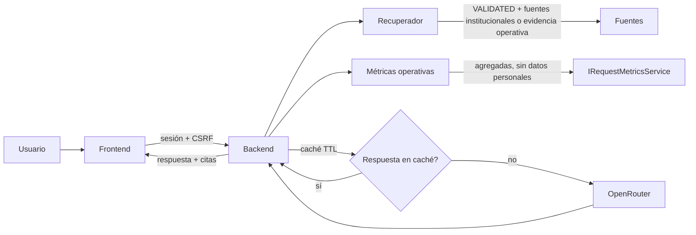

# Asistente Documental con OpenRouter

## Estado de entrega

El asistente académico está integrado entre el backend de Tramita y el frontend. El proveedor permanece deshabilitado por defecto hasta que la Coordinación aporte y valide fuentes institucionales.

La pantalla está en el frontend `tramita-frontend-main/app/assistant/page.tsx` y consume exclusivamente `POST /api/assistant`. La API key nunca se entrega al navegador ni se persiste en el repositorio.

## Flujo



1. El backend valida la pregunta, la sesión y el token CSRF.
2. La búsqueda consulta únicamente fragmentos con estado `VALIDATED`: fuentes `OFFICIAL_INSTITUTIONAL`, `INTERVIEW_EVIDENCE` contrastada con la transcripción original, y `TECHNICAL_REFERENCE` (glosario de estados del propio sistema).
3. Si además la pregunta usa vocabulario operativo ("solicitudes", "trámite", "pendiente", "estado", "promedio"...), el backend suma un bloque de **métricas agregadas en vivo** (`IRequestMetricsService`: totales, distribución por estado, tiempo promedio de ciclo, devoluciones) — sin ningún dato personal. Esto le da al asistente visión de **cómo van los procesos**, no solo de documentos.
4. Sin evidencia documental ni pregunta operativa reconocible, responde `grounded: false` y no llama al proveedor externo.
5. Con evidencia y la integración habilitada, se calcula una clave de caché (pregunta + fuentes usadas). Si hay una respuesta reciente para esa combinación, se reutiliza sin llamar a OpenRouter (`OPENROUTER_CACHE_TTL_SECONDS`).
6. Sin caché disponible, OpenRouter recibe la pregunta y el contexto delimitado por un cliente HTTP reutilizado (HTTP/2, sin reconstruir la conexión en cada llamada) con reintentos ante 429/5xx (backoff exponencial + `Retry-After`) y, si se agotan, un modelo de respaldo opcional (`OPENROUTER_FALLBACK_MODEL`).
7. La respuesta muestra sus fuentes (incluida la fuente sintética "Métricas operativas de Trámita" cuando aplica) y el aviso de que la decisión corresponde a la institución.

El asistente no cambia solicitudes, no ejecuta transiciones y no puede acceder directamente a la base de datos ni al sistema de archivos.

## Eficiencia del proveedor

Estas mejoras reducen la latencia y el costo por consulta sin cambiar el contrato HTTP:

- **Cliente HTTP reutilizado** (`OpenRouterClient.HTTP_CLIENT`, estático, HTTP/2): antes se creaba un `HttpClient` nuevo en cada llamada, perdiendo el pool de conexiones.
- **Reintentos con backoff** ante 429/500/502/503/504, respetando `Retry-After` si el proveedor lo envía — los modelos gratuitos de OpenRouter se saturan seguido y antes cualquiera de esos códigos era un fallo definitivo.
- **Modelo de respaldo opcional** (`OPENROUTER_FALLBACK_MODEL`): si el modelo principal agota reintentos, se intenta una sola vez con el alterno antes de fallar.
- **Caché de respuestas por TTL** (`AssistantResponseCache`, `OPENROUTER_CACHE_TTL_SECONDS`, por defecto 120 s): preguntas repetidas dentro de la ventana no vuelven a consumir el presupuesto del proveedor ni su latencia.

## Visión de procesos (evidencia operativa)

El asistente puede responder preguntas como "¿cuántas solicitudes hay pendientes?" o "¿cómo va el proceso de adición de créditos?" usando `IRequestMetricsService.getRequestMetrics()` — el mismo servicio agregado que ya usa el tablero de indicadores, sin datos personales (`RequestMetricsResponse` lo documenta explícitamente). Un glosario (`docs/openrouter/glosario-estados-asistente.md`, sembrado como fuente `TECHNICAL_REFERENCE` en `V5.3.0__Seed_assistant_state_glossary.sql`) traduce los códigos crudos de `workflow_state` a lenguaje natural para evitar que el modelo adivine su significado.

**Decisión deliberada**: se descartó exponer el detalle de una solicitud individual por folio en el chat. Habilitarlo requeriría reglas de autorización adicionales (quién puede ver el expediente de quién) y abriría una superficie de enumeración de datos personales por texto libre — el costo no se justifica frente a exponer solo agregados, que ya cubre la pregunta real de la Coordinación ("¿cómo va el proceso?", no "¿cómo va Fulano?"). El detalle de una solicitud puntual sigue disponible en la bandeja normal (`GET /api/requests/{id}`), donde el control de acceso ya existe.

La heurística que detecta una pregunta operativa es una lista de palabras clave (`AssistantServiceImpl.OPERATIONAL_KEYWORDS`), no un clasificador de intención: decisión KISS/YAGNI para el volumen de un MVP de dos personas — el costo es que una pregunta operativa con vocabulario distinto puede recibir la abstención segura en vez de una respuesta.

## Configuración local

Las variables están documentadas en `.env.example`:

```text
APP_AI_ENABLED=false
OPENROUTER_API_KEY=
OPENROUTER_BASE_URL=https://openrouter.ai/api/v1
OPENROUTER_MODEL=
OPENROUTER_MAX_TOKENS=500
OPENROUTER_TIMEOUT_SECONDS=20
OPENROUTER_MAX_REQUESTS=10
OPENROUTER_WINDOW_SECONDS=60
OPENROUTER_FALLBACK_MODEL=
OPENROUTER_CACHE_TTL_SECONDS=120
```

Para habilitar el proveedor en un entorno local controlado, establecer `APP_AI_ENABLED=true`, una clave válida fuera del repositorio y un modelo explícito. La clave no se debe copiar a `.env.example`, fixtures, logs ni al frontend.

El backend limita por defecto a 10 consultas por minuto para cada usuario autenticado. Si se supera el límite, responde `429 application/problem+json` e incluye `Retry-After`; el frontend presenta el error del backend sin reintentar automáticamente.

## Activación responsable

Antes de habilitar respuestas normativas se requiere registrar fuentes institucionales con versión, emisor, hash y ubicación, y marcar la fuente como `VALIDATED`. Las entrevistas y los documentos de análisis del proyecto son evidencia de contexto, pero no sustituyen un reglamento ni un procedimiento institucional validado. Las métricas operativas tampoco son norma: son el estado agregado del sistema en el momento de la consulta.

Hasta cumplir esa condición, el comportamiento esperado es una abstención segura:

```json
{
  "answer": "No encontré respaldo suficiente en las fuentes validadas disponibles.",
  "grounded": false,
  "sources": []
}
```

## Evidencia

- Contrato HTTP: `specs/002-workflow-engine/contracts/openapi.yaml`.
- Backend: `mvnw.cmd clean verify -Dit.test=RequestControllerIT -q` con Java 25: 22 pruebas de integración aprobadas.
- Backend (asistente): `mvnw.cmd -Dtest=AssistantServiceImplTest,AssistantRateLimitServiceTest test` — cubre abstención, rechazo sin API key, respuesta fundamentada con citas, pregunta operativa sin evidencia documental y reutilización de caché.
- Frontend: `pnpm test lib/api.test.ts`: 27 pruebas aprobadas.

La evidencia operativa anonimizada de las entrevistas a la Coordinación se carga con la migración `V5.1.0` para la demostración. El asistente la presenta como orientación informativa, no como norma institucional. El siguiente paso para respuestas normativas sigue siendo obtener y validar el Reglamento Estudiantil y los procedimientos de adición de créditos y novedad de notas.

